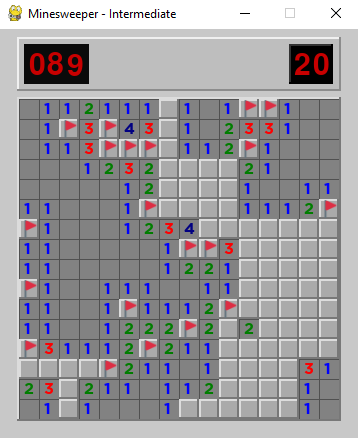

Minesweeper
---
Minesweeper game written in Python using the PyGame library. 
There are 3 levels of difficulty, beginner (9x9, 10 mines), intermediate (16x16, 40 mines), expert (16x30, 99 mines).

How to use
---
Clone the repo and install the requirements. Execute the `main.py` file and enjoy the game!
When the game ended, you can press [R] to restart or escape to leave.

To do
---
- Documentation
- Custom grid (size / number of mines)